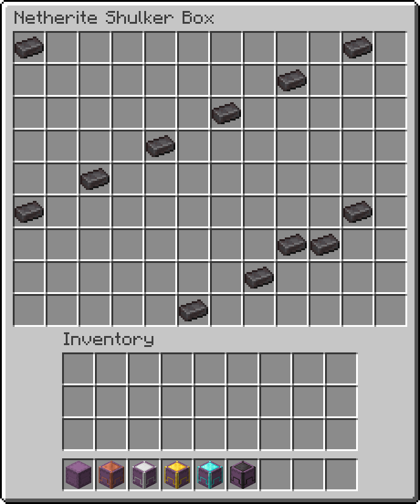
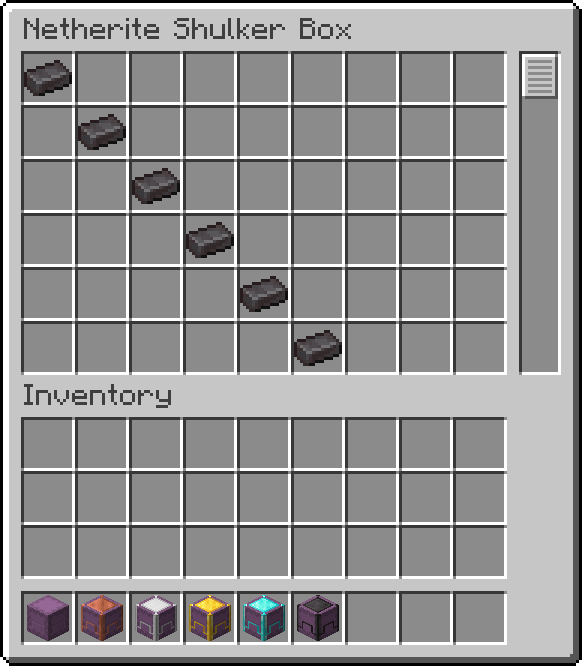
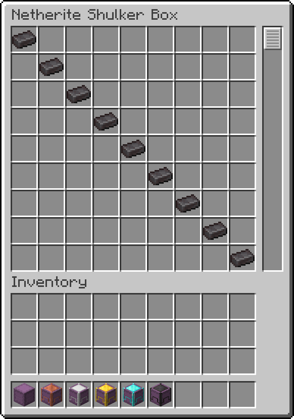

# Reinforced Shulker Boxes

The Reinforced Shulker Boxes mod adds reinforced shulker boxes.

## Reinforced Storage Mod Series

- [Reinforced Chests](https://github.com/Aton-Kish/reinforced-chests)
- [Reinforced Barrels](https://github.com/Aton-Kish/reinforced-barrels)

## Recipe

| Name                  | Type            | Ingredients                           | Recipe                                                                                                           | Description                                                                                 |
| --------------------- | --------------- | ------------------------------------- | ---------------------------------------------------------------------------------------------------------------- | ------------------------------------------------------------------------------------------- |
| Copper Shulker Box    | Shaped Crafting | Shulker Box + Copper Ingot            |                 | A copper shulker box has 45 inventory slots.                                                |
| Iron Shulker Box      | Shaped Crafting | Copper Shulker Box + Iron Ingot       |                     | An iron shulker box has 54 inventory slots.                                                 |
| Gold Shulker Box      | Shaped Crafting | Iron Shulker Box + Gold Ingot         |                     | A gold shulker box has 81 inventory slots.                                                  |
| Diamond Shulker Box   | Shaped Crafting | Gold Shulker Box + Diamond            |               | A diamond shulker box has 108 inventory slots.                                              |
| Netherite Shulker Box | Smithing        | Diamond Shulker Box + Netherite Ingot |  | A netherite shulker box has 108 inventory slots. This is resistant to blast, fire and lava. |

### Crafting from [Reinforced Chests](https://github.com/Aton-Kish/reinforced-chests)

| Name                  | Ingredients                     | Recipe                                                                                                                       |
| --------------------- | ------------------------------- | ---------------------------------------------------------------------------------------------------------------------------- |
| Copper Shulker Box    | Copper Chest + Shulker Shell    |           |
| Iron Shulker Box      | Iron Chest + Shulker Shell      |                 |
| Gold Shulker Box      | Gold Chest + Shulker Shell      |                 |
| Diamond Shulker Box   | Diamond Chest + Shulker Shell   |        |
| Netherite Shulker Box | Netherite Chest + Shulker Shell |  |

### Dyeing

| Name                       | Ingredients                               |
| -------------------------- | ----------------------------------------- |
| Any Reinforced Shulker Box | Any Reinforced Shulker Box + Matching Dye |

Dyed reinforced shulker boxes can be undyed using a cauldron.

## Configure

[The Reinforced Core lib](https://github.com/Aton-Kish/reinforced-core) has been integrated with [Mod Menu](https://www.curseforge.com/minecraft/mc-mods/modmenu) since version 3.0.0.

### Screen Type

_Available in Reinforced Shulker Boxes mod version 2.1.0+._

Screen type is `SINGLE` or `SCROLL`. (default: `SINGLE`)

| `SINGLE` screen                               | `SCROLL` screen                                |
| --------------------------------------------- | ---------------------------------------------- |
|  |  |

### Scroll Screen

#### Rows

_Available in Reinforced Shulker Boxes mod version 2.1.0+._

Rows is an integer in the range from `6` to `9`. (default: `6`)

| Rows: `6`                                              | Rows: `9`                                              |
| ------------------------------------------------------ | ------------------------------------------------------ |
|  |  |

## License

The Reinforced Shulker Boxes mod is licensed under the MIT License, see [LICENSE](./LICENSE).
